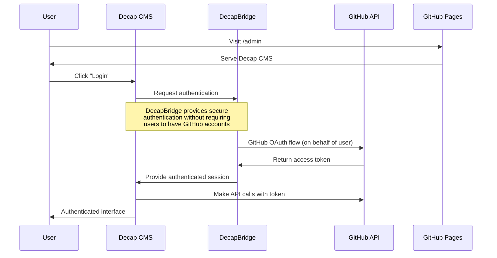

# Next.js Static Blog with Deno 📝🚀

A modern static blog built with **[Next.js](https://nextjs.org/)** running on
**[Deno](https://deno.com/)**, featuring integrated content management and
automated deployment to **GitHub Pages**.

👉 **Live Demo:**
[bemayer.github.io/static-blog](https://bemayer.github.io/static-blog)

## Table of Contents

- [Project Goals](#-project-goals)
- [Tech Stack](#️-tech-stack)
- [Getting Started](#-getting-started)
- [Deployment](#-deployment)
- [Content Management System (CMS)](#-content-management-system-cms)
- [Contributing](#-contributing)

## 📌 Project Goals

- **Static Site Generation**: Fast, SEO-friendly blog with Next.js static export
- **Deno Runtime**: Modern JavaScript runtime without Node.js dependencies
- **GitHub Integration**: Content management and deployment via GitHub
- **Multiple CMS Options**: Choose between advanced or simple content editing

## 🛠️ Tech Stack

- **[Next.js](https://nextjs.org/)** – React framework with static site
  generation
- **[Deno](https://deno.com/)** – Secure runtime for JavaScript and TypeScript
- **[GitHub Pages](https://pages.github.com/)** – Free static site hosting
- **[Tailwind CSS](https://tailwindcss.com/)** – Utility-first CSS framework
- **CMS Options**: Decap CMS or Prose.io for content management

## 🚀 Getting Started

### Prerequisites

- [Deno](https://deno.land/) installed

### Steps

```bash
# Clone the repository
git clone https://github.com/bemayer/static-blog.git

# Navigate to the project folder:
cd static-blog

# Install dependencies:
deno install

# Start the development server:
deno task dev
```

Then open **http://localhost:3000** in your browser.

## 📦 Building for Production

```bash
# Build the static site:
deno task build

# The static files will be generated in the 'out' directory
```

## 🚀 Deployment

### Enable GitHub Pages

1. Go to your repository on GitHub
2. Navigate to **Settings** → **Pages**
3. Under **Source**, select **GitHub Actions**
4. The workflow will automatically deploy when you push to the `main` branch

Your site will be available at `https://yourusername.github.io/repository-name`

## 📝 Content Management System (CMS)

Choose between two content management options based on your needs:

### Option 1: Decap CMS (Advanced)

**Benefits:**

- 🎨 **Visual Editor**: Rich WYSIWYG markdown editor
- 📸 **Media Management**: Upload and organize images
- 👥 **Workflow Support**: Editorial workflow with drafts/reviews
- 🔄 **Real-time Preview**: See changes before publishing

**How it works:** Decap CMS is served as static files at `/admin` and provides a
web-based interface for editing your blog content.

#### Authentication Flow



**Why DecapBridge is used:** DecapBridge allows content creators to access Decap CMS without needing GitHub accounts. It provides a secure authentication layer that handles the OAuth token exchange, allowing users to create their own passwords just for the CMS while maintaining the Git-based workflow.

#### Setup Instructions

1. **Set up DecapBridge Authentication**:
   - Sign up at [decapbridge.com](https://decapbridge.com) (free account)
   - Create a new "Site" for your blog
   - Connect your GitHub repository to the site
   - DecapBridge will automatically handle the GitHub OAuth configuration
   - Copy the provided config.yml settings (identity_url and gateway_url)

2. **Update your CMS configuration**:
   - The `config.yml` file in `/public/admin/` is already configured with DecapBridge
   - No additional setup required - the authentication URLs are pre-configured

3. **Invite collaborators**:
   - In your DecapBridge dashboard, invite users via email
   - Users receive email invites and can create their own CMS passwords
   - No GitHub accounts required for content creators

4. **Access CMS**:
   - Visit `https://yourusername.github.io/repository-name/admin/`
   - Click "Login"
   - Use the credentials created through DecapBridge invitation
   - Start editing your content!

#### Troubleshooting

- **"Cannot connect to repository"**: Ensure your repository is properly linked in your DecapBridge site configuration
- **"Not Found" on /admin**: Ensure the deployment worked and try `/admin/` with trailing slash
- **Authentication issues**: Check that the identity_url and gateway_url in your config.yml match your DecapBridge site settings
- **User access problems**: Verify that users have been properly invited through the DecapBridge dashboard
- **Login loops**: Clear browser cache and cookies, and ensure users are using the correct DecapBridge credentials

### Option 2: Prose.io (Simple)

**Benefits:**

- 🚀 **Zero Setup**: No configuration required
- 🔗 **Direct GitHub**: Connects directly to your repository
- ⚡ **Lightweight**: Simple markdown editing interface
- 🔓 **No External Dependencies**: Works with just GitHub authentication

**How to use:**

1. Visit [prose.io](https://prose.io)
2. Authorize with your GitHub account
3. Navigate to your repository → `posts` folder
4. Edit existing posts or create new ones
5. Commit changes directly to GitHub

**When to choose:**

- You prefer simple markdown editing over visual editors
- You don't want to set up external services
- You occasionally edit content and don't need advanced features
- You're comfortable with markdown syntax

**Limitations:**

- No media upload interface (add images manually to `public/images/`)
- Basic markdown editor (no WYSIWYG)
- No editorial workflow features
- No real-time preview

## 🤝 Contributing

Contributions are welcome! Feel free to:

- 🐛 Report bugs
- 💡 Suggest new features
- 📝 Improve documentation
- 🔧 Submit pull requests

---

**Author**: [Benoît Mayer](https://github.com/bemayer)

**License**: MIT
